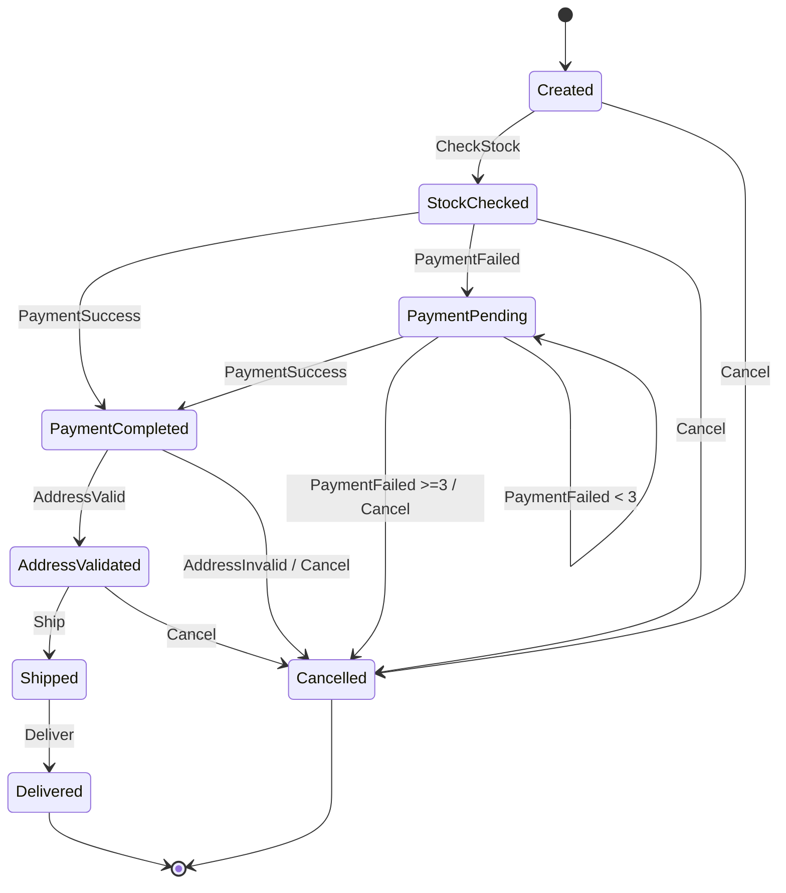
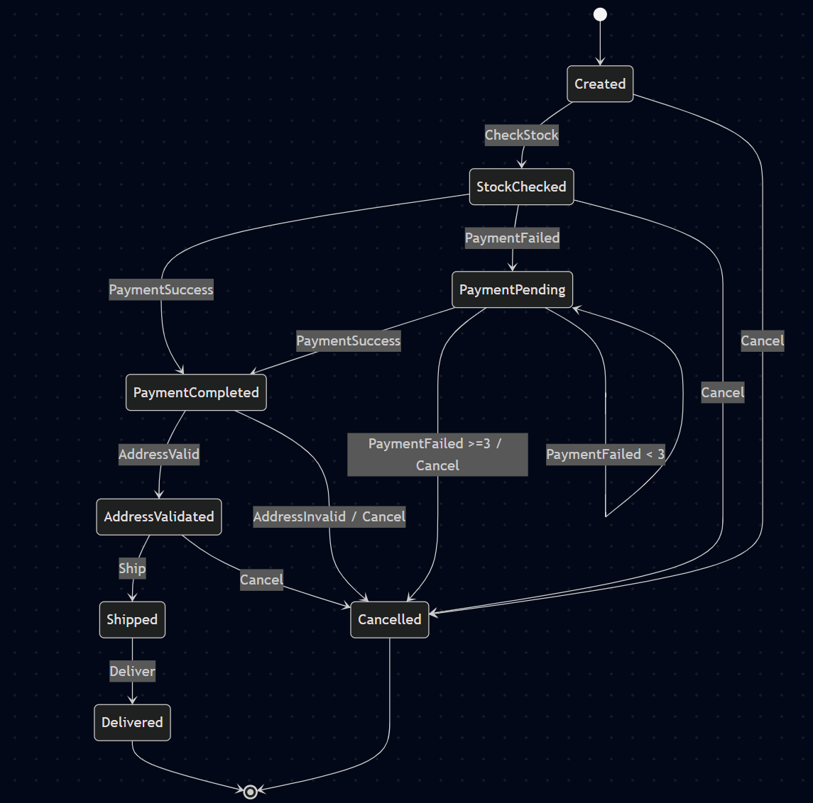

# Order State Machine Demo

[](https://github.com/dotnet/core/workflows/.NET/badge.svg)
[](https://opensource.org/licenses/MIT)

A **C# .NET 8 console application** demonstrating an **event-driven state machine** for managing order lifecycles using the [Stateless](https://github.com/dotnet-state-machine/stateless) library. Features persistence with **EF Core + SQLite** and **domain events**.

## 🚀 Features
- **State Machine**: Full order workflow with 8 states and conditional transitions (e.g., payment retries up to 3x, **real stock check** querying DB Stock table).
- **Persistence**: SQLite DB via EF Core; state/payment attempts/requiredQuantity auto-saved. **Cancel deletes order entry**.
- **Domain Events**: Publishes `PaymentFailedEvent`, `OrderShippedEvent`, `OrderDeliveredEvent`.
- **Interactive Demo**: Simulates complete workflow in `Program.cs` (fresh DB each run).
- **Robust**: Invalid triggers ignored; detailed console logging.

**Stateless Key Points:**
Here’s a **brief summary** of what we covered:

- **`.OnEntry`** → Runs every time you enter a state, in the order registered, sequentially.  
- **`.OnEntryFrom`** → Runs only when entering from a specific trigger/state, after `.OnEntry`. (Used for stock check on CheckStock).  
- **Multiple `.OnEntry`** → Executed **sequentially**, not in parallel.  
- **Async work** → You must explicitly start it:
  - `Task.Run(...)` → fire-and-forget background work.  
  - `async/await` → makes the transition wait until the async work completes.  
- **Mixing `.OnEntry` and `.OnEntryFrom`** → General `.OnEntry` actions run first, then the matching `.OnEntryFrom`.  
- **Best practice** → Use async delegates for predictable sequencing; use `Task.WhenAll` if you want parallel async tasks inside a single entry action.  

👉 In short: **deterministic, sequential by default — parallel only if you explicitly code it.**

## 🏗️ Architecture
```
Created ──[CheckStock]──> StockChecked ──[PaymentSuccess]──> PaymentCompleted ──[AddressValid]──> AddressValidated ──[Ship]──> Shipped ──[Deliver]──> Delivered
  │                  │                                        │
  └─[Cancel]────> Cancelled    [PaymentFailed → retry (x3)] ──┘
                                           │
                                     [PaymentFailed x3] ──> Cancelled
```

**Key Components**:
- `OrderStateMachine.cs`: Configures `Stateless.StateMachine<OrderState, OrderTrigger>`.
- `Domain/OrderState.cs`: State/Trigger enums.
- `Persistence/`: EF models/context.
- Events in `Domain/Events/`.

## 🔧 Quick Start
### Prerequisites
- [.NET 8 SDK](https://dotnet.microsoft.com/download/dotnet/8.0)

### Run
```bash
cd c:/SorceCode/OrderStateMachineDemo
dotnet restore  # If needed
dotnet run
```

**Sample Output**:
```
╔══════════════════════════════════════════════════════╗
║     Order State Machine Demo — Event-Driven Demo     ║
╚══════════════════════════════════════════════════════╝

[DB] New order seeded — Id=1
[OrderStateMachine] Initialized Order #1 — State: Created, PaymentAttempts: 0

━━━  Step 1: Check Stock  ━━━━━━━━━━━━━━━━━━━━━━━━━━━━
  → Firing: CheckStock  (State before: Created)
  ✓ State after:  StockChecked
[State] Stock has been checked.
[DB] Persisted — State=StockChecked, PaymentAttempts=0
...
Final State : Delivered
Done. ✅
```

## 📊 State Diagram


**Interactive Mermaid** (copy to [mermaid.live](https://mermaid.live)):






## 📦 Dependencies
| Package | Version | Purpose |
|---------|---------|---------|
| Stateless | 5.16.0 | State machine |
| Microsoft.EntityFrameworkCore.Sqlite | 8.0.0 | DB |
| Microsoft.EntityFrameworkCore | 8.0.0 | ORM |
| Microsoft.EntityFrameworkCore.Design | 8.0.0 | Migrations |

See [`OrderStateMachineDemo.csproj`](OrderStateMachineDemo.csproj).

## 🔍 Explore
- Run `dotnet run` to see workflow.
- Inspect `orders.db` (SQLite) post-run.
- Extend: Add guards, sub-states, async triggers.

## 🤝 Contributing
PRs welcome! Fork → Branch → PR.

## 📄 License
MIT — see [LICENSE](LICENSE) (create if needed).

